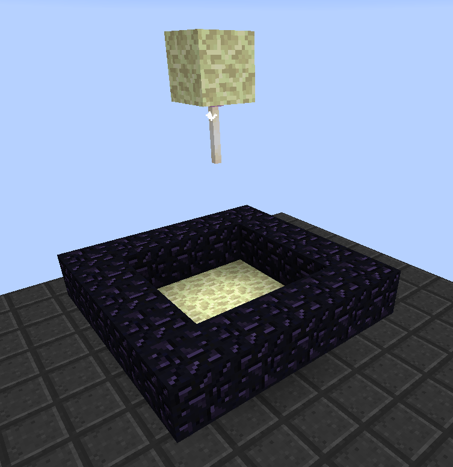
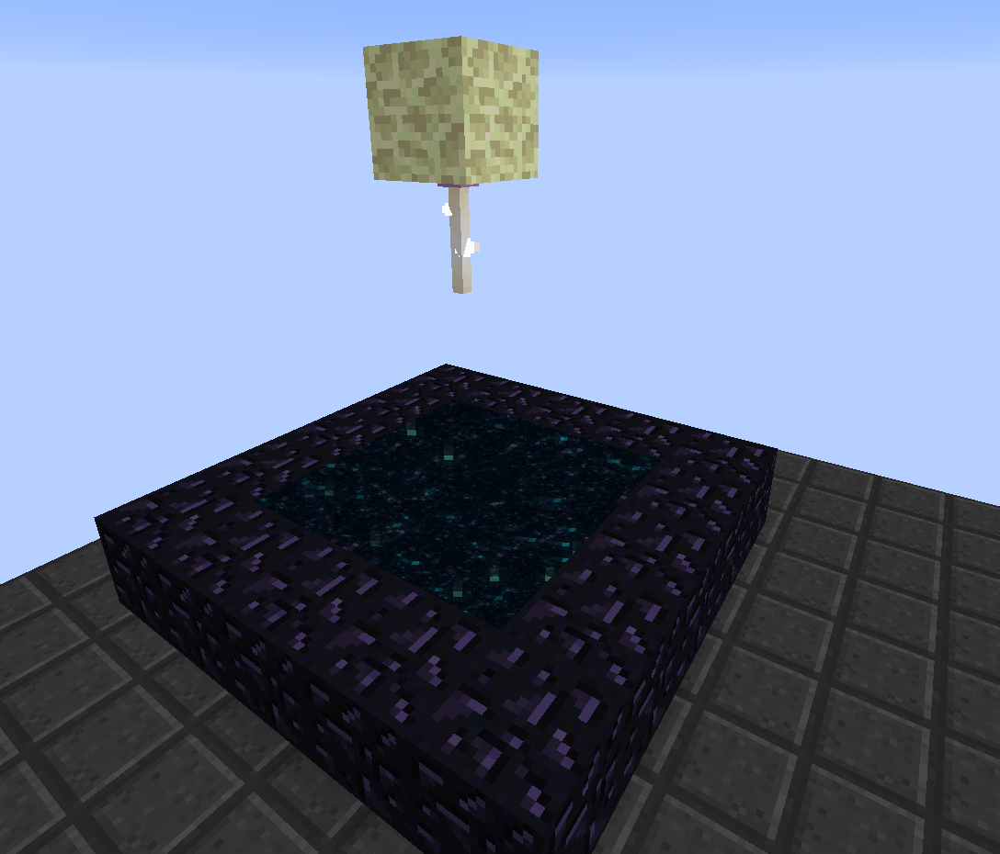

Getting to The End can be done with the help of the Random Things mod. You are able to create an artificial End Portal. These are created using End Stones, Obsidian, an End Rod and then using an Evil Tear to activate the portal. The structure is farly simple to build by creating a 3x3 base of End Stone, and then a 5x5 ring of Obsidian 1 level higher than the End Stone base. Add a single block of End Stone 5 blocks higher than the base above the centre block and place an End Rod directly below this block. Finally hit the End Rod with the Evil Tear to open the portal.

