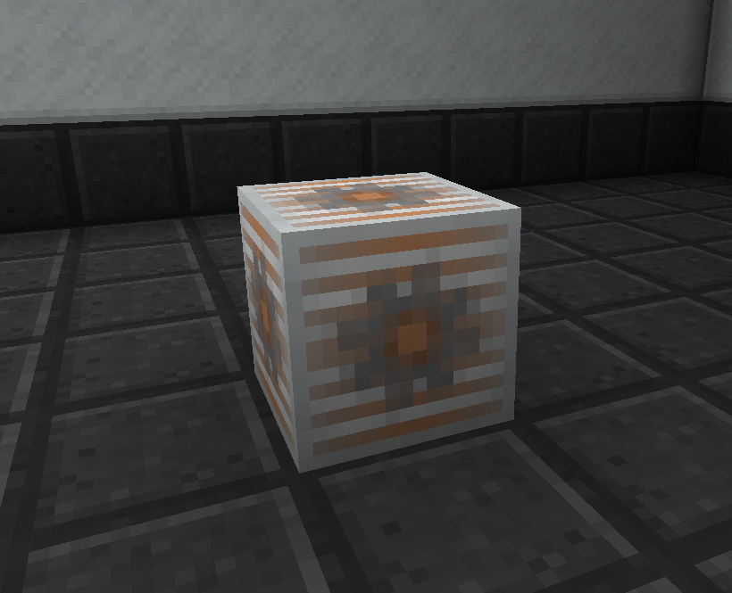

The Beast Coin Miner is a new block that is designed to supplement the Beast Coin income that you get from quests. Feeding power directly into the Beast Coin Miner will start the process of 'mining' coins.  Players should be aware that every time you 'mine' a coin, the cost of the next coin increases.

