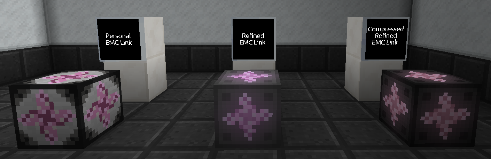
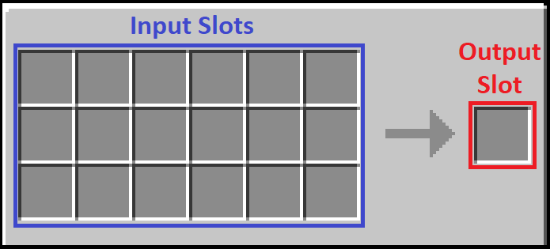

First introduced in Stoneblock 2, FTB Odyssey brings enhanced versions of the Personal EMC Link.

The personal Link is used as an inventory that can be used to both automate EMC input but also be used as an external item storage block connected to either a storage system or a item transport network. 

When connected to a network, any items placed in the output slot will be automatically supplied to that network as long as you have enough EMC to cover the cost of that item.

The Refined EMC link and Compressed Refined EMC Link provide more output slots allowing you to provide multiple items to a storage network.

