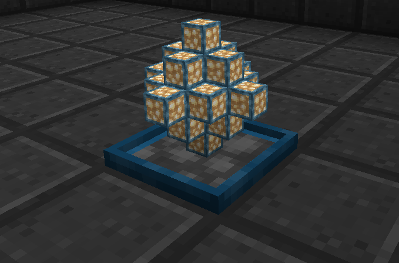

In addition to power, the other main resource in this pack is EMC. For players wanting to reach end game generation of EMC you can combine Energy Collectors with  Energy Relays to produce huge amounts of EMC. These can be fed directly into a 'Personal Link' which can automatically collect and store EMC.

In addition to this we have added in Power Flower Bonsai Pots which can be used to produce extreme amounts of EMC.

