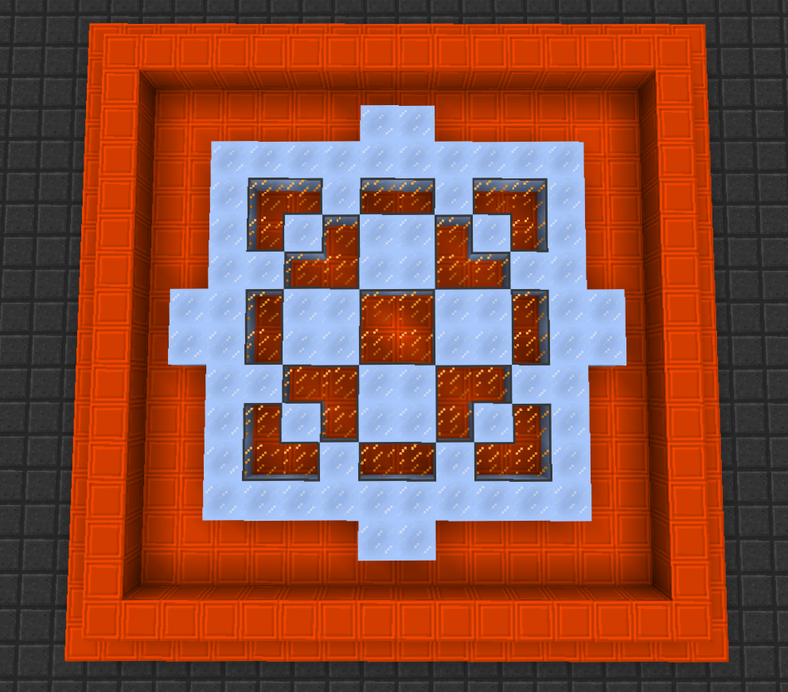
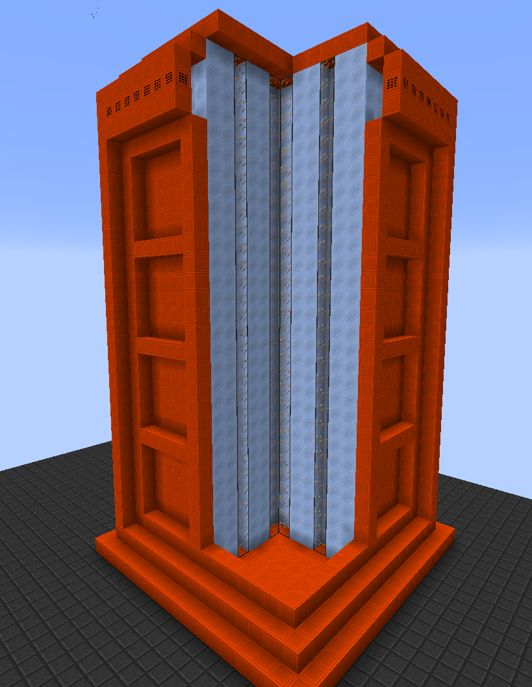
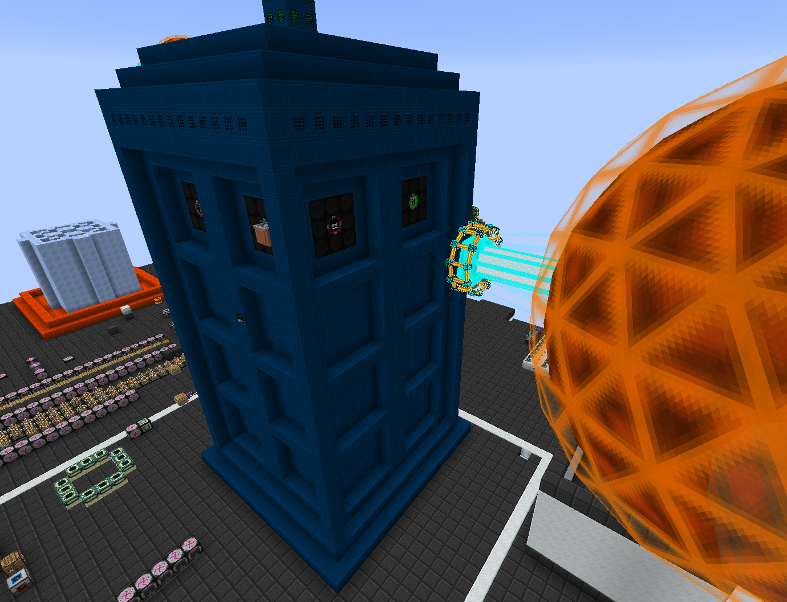

The Tardis Generator is a brand new custom machine made using Modular Machinery for this pack. It is built using ultra expensive blocks and is designed to produce massive amounts of RF power. In addition it is used for a couple of end game recipes. You can find the full recipe for the tardis along with a guide to building the tardis from the Tardis Blueprint. Whilst the Generator is capable of producing extreme amounts of power, to effectively extract that power it must be placed near to a Draconic Evolution Energy Core (within 24 blocks of the centre block)

