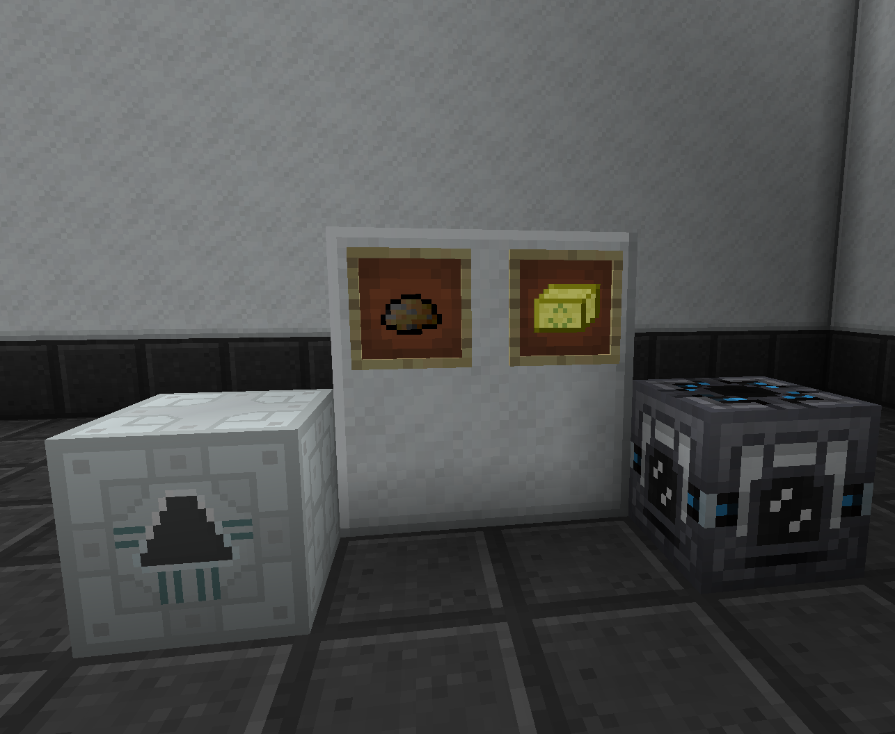

UU-Matter can be created in a Matter Fabricator. The Matter Fabricator comes in 2 varieties, the first from IndustrialCraft 2 runs on EU and operates slowly. The Second version from Tech Reborn runs on RF power and operates a bit faster. Both machines can be boosted using either scrap or scrap boxes to increase the speed that UU-Matter is produced.

