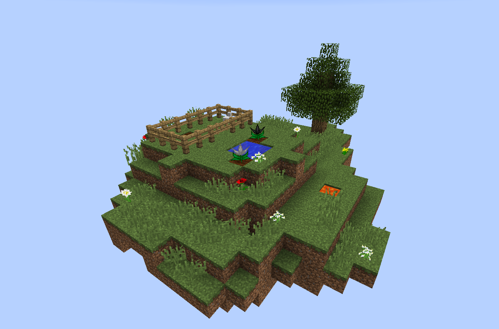
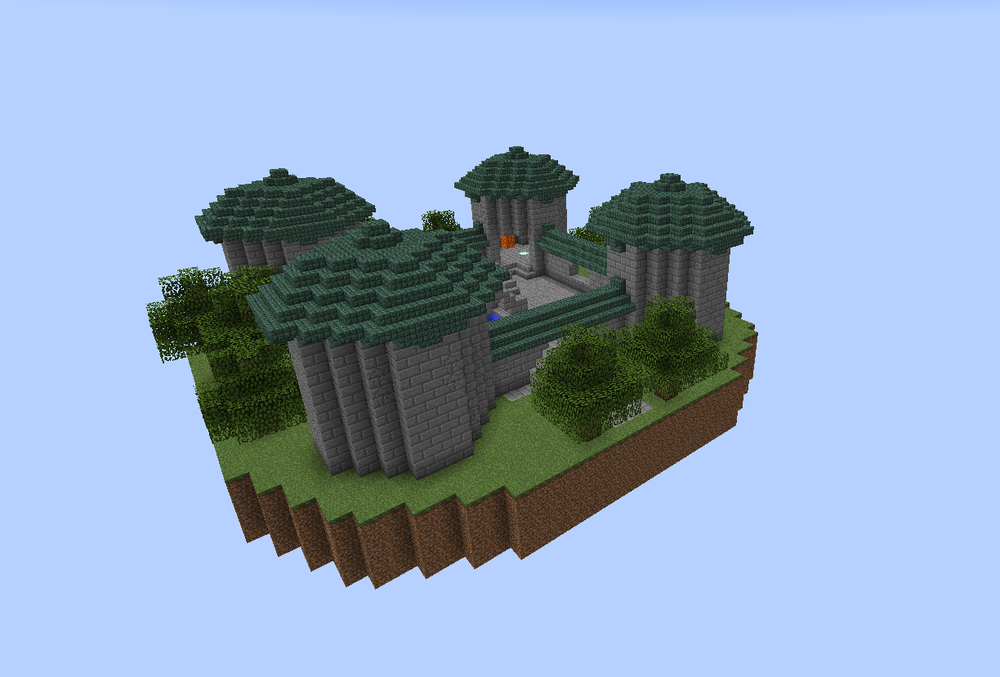
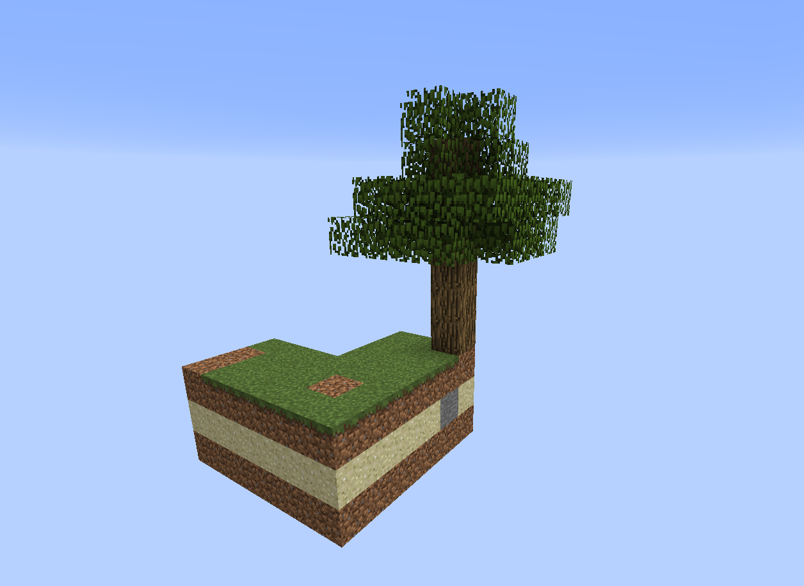
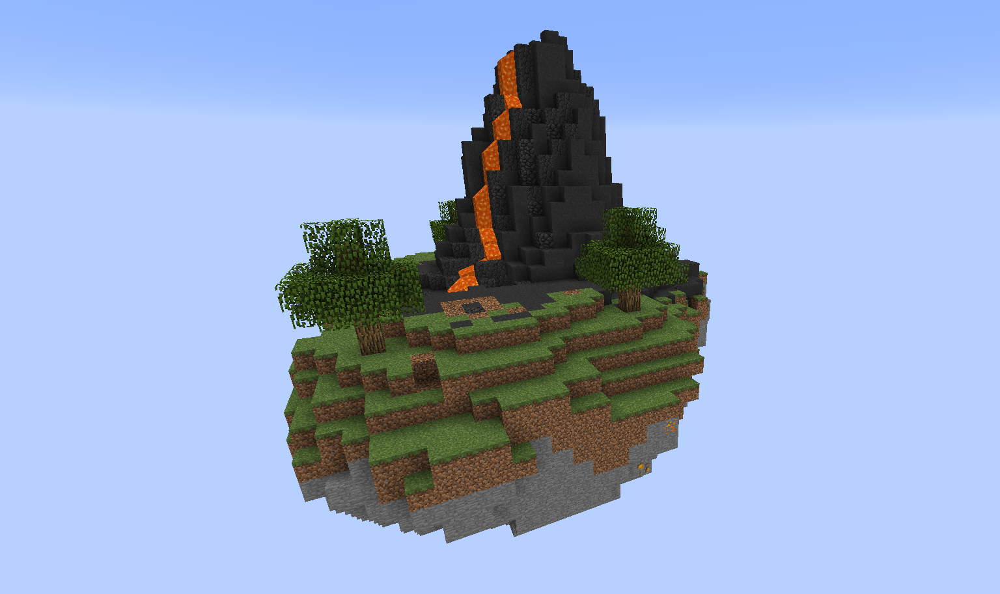

Before you started this pack you would have seen that you had different choices with regards to starting islands. One of the goals was to design a pack that could be played through several times whilst you find different ways of making progress. With this in mind we have included several different starting islands and different degrees of difficulty for some of these islands. The goal is to give you some variety to the start of the modpack however all of these islands will bring you to a similar place after a few hours of play. Feel free to try some of them out.

We are also looking to add the option to allow other people to submit their own creations to be used as starter islands in future releases.

Standard

Castle

Skyblock

Volcano

