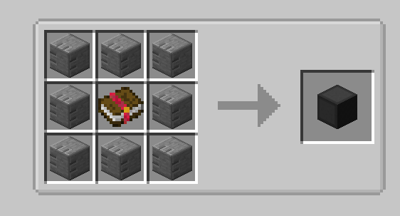
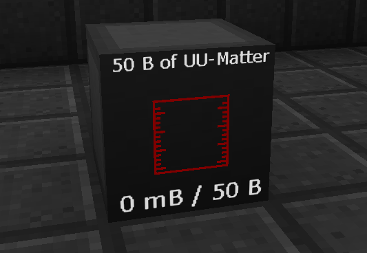

During the playthrough of the pack you can complete various repeatable quests in order to earn more money to spend in the shop. These repeatable quests are in the form of various liquids that can be made. These liquids can be submitted by connecting the fluid output to a task screen (These screens are craftable).

As soon as you have collected a reward, the screen will reset allowing you to start again.

